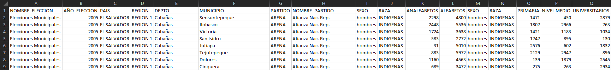
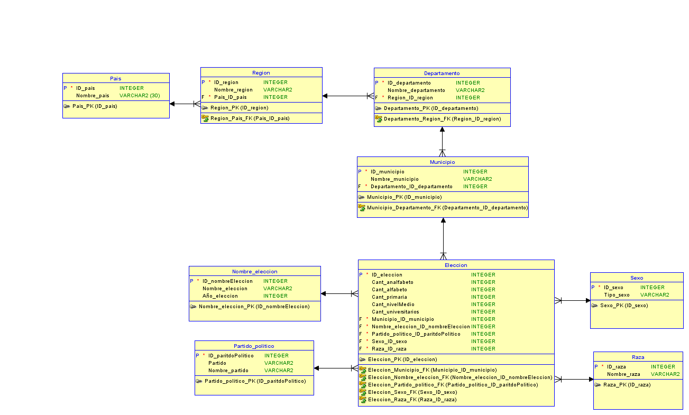
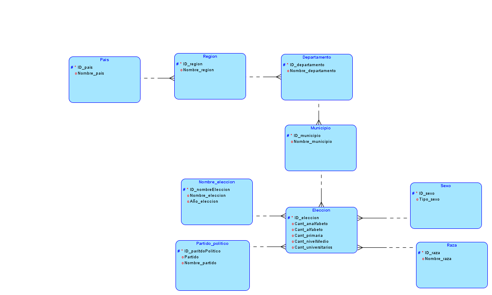

#   Documentacion 
##  Proyecto 2
  

#   NORMALIZACION
Para la creacion de la base de datos para El Instituto Centraoamericano Electoral (ICE), se ulilizo el archivo <a href ="https://tinyurl.com/yykzknzh">archivo.xls</a> con el cual se analizo la estructura del mismo y se realizo el diagrama de la base de datos, se explicaran los pasos requeridos para implementar este modelo a continuacion.

##  Archivo de entrada

Aplicando la primera regla de Normalizacion se separaron los siguientes datos en entidades diferentes

* Se separo la entidad País debido a que se presentan pocos datos variables en esta columna por lo cual seria repetitivo, de igual forma pasa con las columnas de región, departamento y municipio, por este motivo se decidió aislar cada una de estas columnas convirtiéndose cada una de ellas en una nueva entidad con distintas propiedades, por lo tanto las entidades quedan de la siguiente forma:

|Pais|
|----|
|ID_pais|
|Nombre_pais|

|Region|
|----|
|ID_region|
|Nombre_region|

|Departamento|
|----|
|ID_departamento|
|Nombre_departamento|

|Municipio|
|----|
|ID_municipio|
|Nombre_municipio|

*   Como resultado de esta division de columnas se ve reducido el modelo inicial el cual aun contiene los siguientes datos.

|Nombre_eleccion|Año_eleccion|Partido|Nombre_partido|Sexo|Raza|Analfabetos|Alfabetos|Sexo|Raza|Primaria|Nivel_medio|Universitarios|
|---|---|---|---|---|---|---|---|---|---|---|---|---|
|xxxx|xxxx|xxxx|xxxx|xxxx|xxxx|xxxx|xxxx|xxxx|xxxx|xxxx|xxxx|xxxx|

*   Teniendo en cuenta las entidades que se generaron a partid de la primera normalización se aplica la segunda forma de Normalizacion la cual nos permite relacionar las tablas con una llave externa, para este caso sabemos que estas entidades son gradualmente dependientes y se relacionaran 

|Pais|
|----|
|ID_pais|
|Nombre_pais|

|Region|
|----|
|ID_region|
|Nombre_region|
|FK_ID_pais|

|Departamento|
|----|
|ID_departamento|
|Nombre_departamento|
|FK_ID_region|

|Municipio|
|----|
|ID_municipio|
|Nombre_municipio|
|FK_ID_departamento|

|Eleccion|
|--|
|ID_eleccion|
|Nombre_partidoPolitico|
|PartidoPolitico|
|Sexo|
|Tipo_raza|
|Cant_analfabeto|
|Cant_alfabeto|
|Cant_primaria|
|Cant_nivelMedio|
|Cant_Universitario|

  

*   Siguiendo con la optimización del modelo relacional que se implementara en la base de datos podremos aplicar a estas entidades la tercera forma de normalización eliminando los campos que no dependen de la clave, para ello en la entidad de elección se separara en distintas entidades desligando mas entidades como se muestra a continuación.
   
|Pais|
|----|
|ID_pais|
|Nombre_pais|

|Region|
|----|
|ID_region|
|Nombre_region|
|FK_ID_pais|

|Departamento|
|----|
|ID_departamento|
|Nombre_departamento|
|FK_ID_region|

|Municipio|
|----|
|ID_municipio|
|Nombre_municipio|
|FK_ID_departamento|

|Eleccion|
|--|
|Cant_analfabeto|
|Cant_alfabeto|
|Cant_primaria|
|Cant_nivelMedio|
|Cant_Universitario|
|FK_ID_nombreEleccion|
|FK_ID_partidoPolitico|
|FK_ID_municipio|
|FK_ID_sexo|
|FK_ID_raza|

|Sexo|
|--|
|ID_Sexo|
|Tipo_sexo|

|Raza|
|--|
|ID_raza|
|Nombre_raza|

|Nombre_Eleccion|
|--|
|ID_nombreEleccion|
|Nombre_eleccion|
|Año_eleccion|

|Partido_politico|
|--|
|ID_paritidoPolitico|
|Partido|
|Nombre_partido|

#   LISTADO DE ENTIDADES
  
*   Pais
*   Region
*   Departamento
*   Municipio
*   Eleccion
*   Nombre_eleccion
*   Partido_politico
*   Sexo
*   Raza

 
 

#   MODELO ENTIDAD DE RELACION

#   MODELO LOGICO

  
  

#   LISTADO DE ATRIBUTOS

*   Pais

|Nombre|Tipo|Primary|Forean|Unique|Not Null|
|--|--|--|--|--|--|
|ID_pais|integer|X||X|X|
|Nombre_pais|varchar||||X|

  
*   Region

|Nombre|Tipo|Primary|Forean|Unique|Not Null|
|--|--|--|--|--|--|
|ID_region|integer|X||X|X|
|Nombre_region|varchar||||X|
|FK_ID_pais|integer||X|X|X|

  
*   Departamento

|Nombre|Tipo|Primary|Forean|Unique|Not Null|
|--|--|--|--|--|--|
|ID_departamento|integer|X||X|X|
|Nombre_departamento|varchar||||X|
|FK_ID_region|integer||X|X|X|

  
*   Municipio

|Nombre|Tipo|Primary|Forean|Unique|Not Null|
|--|--|--|--|--|--|
|ID_municipio|integer|X||X|X|
|Nombre_municipio|varchar||||X|
|FK_ID_departamento|integer||X|X|X|

  
*   Nombre_eleccion

|Nombre|Tipo|Primary|Forean|Unique|Not Null|
|--|--|--|--|--|--|
|ID_nombre_eleccion|integer|X||X|X|
|Nombre_eleccion|varchar||||X|
|Año_eleccion|varchar||||X|

  
*   Partido_politico

|Nombre|Tipo|Primary|Forean|Unique|Not Null|
|--|--|--|--|--|--|
|ID_partidoPolitico|integer|X||X|X|
|Partido|varchar||||X|
|Nombre_partido|varchar||||X|

  
*   Sexo

|Nombre|Tipo|Primary|Forean|Unique|Not Null|
|--|--|--|--|--|--|
|ID_sexo|integer|X||X|X|
|Tipo_sexo|varchar||||X|

  
*   Raza

|Nombre|Tipo|Primary|Forean|Unique|Not Null|
|--|--|--|--|--|--|
|ID_raza|integer|X||X|X|
|Nombre_raza|varchar||||X|

  
*   Eleccion

|Nombre|Tipo|Primary|Forean|Unique|Not Null|
|--|--|--|--|--|--|
|ID_eleccion|integer|X||X|X|
|Cant_analfabeto|integer||||X|
|Cant_alfabeto|integer||||X|
|Cant_primaria|integer||||X|
|Cant_nivelMedio|integer||||X|
|Cant_Universitario|integer||||X|
|FK_ID_nombreEleccion|integer||X|X|X|
|FK_ID_partidoPolitico|integer||X|X|X|
|FK_ID_municipio|integer||X|X|X|
|FK_ID_sexo|integer||X|X|X|
|FK_ID_raza|integer||X|X|X|

#   RELACIONES ENTRE ENTIDADES

*   Pais

|Entidad 1|Relacion|Entidad 2|
|--|--|--|
|Pais|Uno a muchos|Region|

 
*   Region

|Entidad 1|Relacion|Entidad 2|
|--|--|--|
|Region|Uno a muchos|Departamento|

 
*   Departamento

|Entidad 1|Relacion|Entidad 2|
|--|--|--|
|Departamento|Uno a muchos|Municipio|

 
*   Municipio

|Entidad 1|Relacion|Entidad 2|
|--|--|--|
|Municipio|Uno a muchos|Eleccion|

 
*   Eleccion

|Entidad 1|Relacion|Entidad 2|
|--|--|--|

 
*   Nombre_eleccion

|Entidad 1|Relacion|Entidad 2|
|--|--|--|
|Nombre_eleccion|Uno a muchos|Eleccion|

 
*   Partido_politico

|Entidad 1|Relacion|Entidad 2|
|--|--|--|
|Partido_politico|Uno a muchos|Eleccion|

 
*   Sexo

|Entidad 1|Relacion|Entidad 2|
|--|--|--|
|Sexo|Uno a muchos|Eleccion|

 
*   Raza

|Entidad 1|Relacion|Entidad 2|
|--|--|--|
|Raza|Uno a muchos|Eleccion|

#   RESTRICCION PARA UTILIZAR

*   Entidad Pais:
    *   ID_pais: Restricción para que el número sea único y auto incrementable.
  
 

*   Entidad Region:
    *   ID_region: Restricción para que el número sea único y auto incrementable.
    *   FK_ID_ciudad: Restriccion para que sea numero y no nulo.
 

*   Entidad Departamento:
    *   ID_departamento: Restricción para que el número sea único y auto incrementable.
    *   FK_ID_region: Restriccion para que sea numero y no nulo.

 

*   Entidad Municipio:
    *   ID_municipio: Restricción para que el número sea único y auto incrementable.
    *   FK_ID_departamento: Restriccion para que sea numero y no nulo.

 

*   Entidad Eleccion:
    *   ID_eleccion: Restricción para que el número sea único y auto incrementable.
    *   FK_ID_municipio: Restriccion para que sea numero y no nulo.
    *   FK_ID_nombreEleccion: Restriccion para que sea numero y no nulo.
    *   FK_ID_partidoPolitico: Restriccion para que sea numero y no nulo.
    *   FK_ID_sexo: Restriccion para que sea numero y no nulo.
    *   FK_ID_raza: Restriccion para que sea numero y no nulo.

 

*   Entidad Nombre_eleccion:
    *   ID_nombreEleccion: Restricción para que el número sea único y auto incrementable.

 

*   Entidad Partido_politico:
    *   ID_partidoPolitico: Restricción para que el número sea único y auto incrementable.

 

*   Entidad Sexo:
    *   ID_sexo: Restricción para que el número sea único y auto incrementable.

 

*   Entidad Raza:
    *   ID_raza: Restricción para que el número sea único y auto incrementable.

#   CONSIDERACION DE DISEÑO

En el diseño del modelo de entidad de relacion utilizando los datos proporcionados por la empresa se separó la localizacion de las elecciones en Pais, Region, Departamento y Municipio. Cada una de estas cuenta con un atributo que describe el nombre de al localizacion asi como una llave foranea la cual cumple la funcion de relacionar la entidades de manera gradual ya que cada una puede ser contenida por la otra.

Siguiendo con las necesidades de la institucion se realizo la creacion de 4 entidades mas las cuales son:
*   Nombre_eleccion
*   Partido_politico
*   Sexo
*   Raza

Cada una de estas entidades contiene informacion individual de todas las personas que acudieron a un centro de votacion a emitir su voto.

Para el nombre de eleccion se describe el nombre de la elección y el año en que esta se realizo.

Para la entidad de Partido_politico se describe el nombre completo del partido como su abreviacion publica utilizada para la propaganda.

Con la entidad de sexo se tiene la descripcion de los 2 tipos de sexo registrados en la votación los cuales son: Hombres y mujeres.

Para la reza se realizo una entidad extra para agrupar todas las razas presentadas a votar separandolas de la entidad de eleccion para que no produjera el error de repitencia de datos.

Dados estos acontecimientos se agrupo la seleccion de toda la cantidad de elecciones en la entidad de Eleccion, la cual encapsula todos los valores segun cada una de las categorias diferentes a las que fueron agrupados como lo son:

*   Nombre_eleccion
*   Partido_politico
*   Sexo
*   Raza
*   Municipio

Ya que con cada una de estas categorias se realizo un calculo segun el nivel de analfabetizmo y alfabetismo separados en nivel primaria, nivel medio y universitarios.

